 
 

 

## 🧭 About

I'm a self-taught developer from Nepal, grinding through +2 Science while shipping real projects. I don't collect tutorials — I build, break, and rebuild until I understand how things work under the hood.

|                    |                                                          |
| ------------------ | -------------------------------------------------------- |
| 🎯 **Focus**       | CS core · Cybersecurity |
| 📚 **Learning**    | Networking · DBMS · Operating Systems |

 

## 🧰 Stack

 

## 📈 Activity

 

